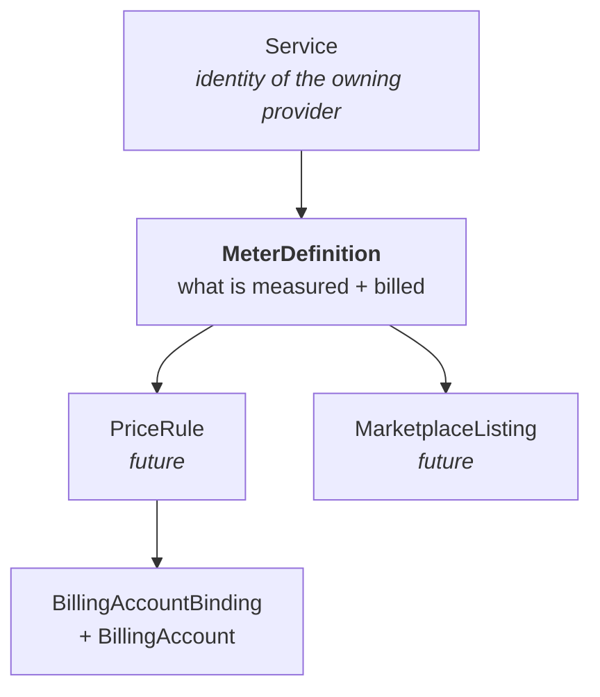

# Enhancement: Metering Definitions

**Status:** Draft for stakeholder review
**Author:** Service infrastructure team
**Scope:** Introduces `MeterDefinition`, a first-class resource on `services.miloapis.com/v1alpha1`. Sibling to [`Service`](./service-registry.md) and [`MonitoredResourceType`](./monitored-resource-types.md).

> **In one line.** The platform-owned record of a single billable dimension — the stable join key that billing, pricing, marketplace, the portal, and FinOps exports all point at.

---

## What a meter is

Every service a provider offers on Milo measures something its consumers use — CPU seconds, GB-hours, API calls, bytes transferred. A **meter** is the declarative record of one such measurement: what is being measured, in what unit, how it aggregates into a bill, who owns it, and what state it's in.

A meter is not a price. It's not a quota. It's not an event. It's the identity and semantics of one billable dimension — the stable join key that every commerce-adjacent system points at.

## Why it matters

Without a shared catalog, every provider answers the same questions in isolation. One provider names their meter one way; another names a similar meter differently. Finance keeps the list in a spreadsheet. The portal can't explain to a consumer what `datum.storage.replicated.bytes-hours` means because nothing owns the answer. A new provider arrives wanting to list a meter on the marketplace and finds no standard way to do it.

The mistakes compound in ways that don't show up until they hurt.

- Two teams inside one provider choose subtly different spellings for the same dimension.
- A dimension quietly disappears from the next version of a meter, and nobody notices until the next invoice run.
- A consumer asks what `cpu_s` means and no one can answer without tribal knowledge.

A catalog every system reads from makes those mistakes either impossible or loud.

## How it works

### Declaring a meter

A provider publishes one `MeterDefinition` per billable dimension. The spec is organised into three blocks so readers understand a meter at a glance: **identity**, **measurement**, **billing framing**.

```yaml
apiVersion: services.miloapis.com/v1alpha1
kind: MeterDefinition
metadata:
  name: compute-instance-cpu-seconds
spec:
  phase: Draft
  meterName: compute.miloapis.com/instance/cpu-seconds
  displayName: Compute Instance CPU Time
  description: CPU time consumed by running compute instances, measured at 1-minute resolution.
  owner:
    service: compute.miloapis.com

  measurement:
    aggregation: Sum
    unit: s
    dimensions: [region, instance.type, resource.tier]

  billing:
    consumedUnit: s
    pricingUnit: h
```

**Two names, deliberately.** `metadata.name` is the Kubernetes slug. `spec.meterName` is the canonical business identifier that appears on invoices, in marketplace listings, and in FinOps exports. Same convention as `Service` and `MonitoredResourceType`.

**Owner is a reference.** `spec.owner.service` points at a Published `Service` in the registry — not a free-text string.

**Measurement describes the signal.** `aggregation` says how values roll up over a billing period (Sum, Max, Count, and a handful more). `unit` uses the UCUM unit vocabulary (`s` for seconds, `By` for bytes, `GBy.h` for GB-hours — no invented strings). `dimensions` declares the attributes pricing or the portal can group by.

**Billing framing crosses into commerce.** `consumedUnit` is what's measured; `pricingUnit` is what pricing quotes against; the engine handles conversion. `chargeCategory` (`Usage`, `Purchase`, `Adjustment`) comes from the FOCUS open-finance spec, so exports to external tooling work without translation. No rates live here — that's pricing's job.

### Being referenced

Once `Published`, downstream systems start reading the meter. The billing usage pipeline looks up the definition by `meterName` to know how each event aggregates.

```yaml
meterName: compute.miloapis.com/instance/cpu-seconds
value: "42"
dimensions:
  region: us-east-1
  tier: standard
```

Future consumers work the same way. Pricing rules attach to a `meterName`. Marketplace listings surface its `displayName` and `description`. FinOps exports read `chargeCategory` and `pricingUnit` directly. None of them re-declare what the meter *is* — they join on the name and read everything else from the definition.

### Lifecycle

Meters change. A new dimension gets added. A description is refined. A unit turns out to be wrong. Four states cover every case:

- **Draft.** Iterating. Invisible to pricing, marketplace, invoicing. Freely editable.
- **Published.** The steady state. `meterName`, `unit`, and `aggregation` are locked. Display name, description, and new dimensions still evolve.
- **Deprecated.** Still priceable and billable for existing consumers; hidden from new rate cards. Signals intended retirement without breaking anyone today.
- **Retired.** No longer billable. Preserved for audit.

Breaking changes ship as a new meter with a new name — `…/cpu-seconds/v2` replaces `…/cpu-seconds/v1`. Never a silent mutation. The platform won't let a meter be deleted while anything downstream still references it, so nothing vanishes from under pricing or invoicing.

### The bigger picture



The meter definition is the spine between measurement and commerce. Billing is the first consumer today. Quota showback, capacity planning, partner SKUs, and marketplace are expected follow-ons.

## What this unlocks

- **Self-service rate cards.** Pricing builds against a stable catalog without chasing schemas.
- **Marketplace listings.** Partners publish meters; marketplace lists them with the right unit and description automatically.
- **Consumer-visible usage.** Portal and invoices link each line item to a meter, showing its unit, aggregation, and plain-English description.
- **Clean FinOps exports.** Adopting the FOCUS vocabulary makes exports a column-mapping exercise, not a translation project.
- **Decoupled delivery.** Pricing, invoicing, and marketplace teams can all build in parallel against one stable surface.

## What this isn't

- Not a usage-ingestion pipeline. The billing usage pipeline consumes meters; this resource doesn't move events or calculate totals.
- Not a pricing engine. No rates, tiers, currencies, discounts.
- Not a contract or quote system. No commitments, prepayment, or negotiation state.
- Not a metric-emission SDK. Providers emit events aligned with the meter they declared. The catalog is here; the telemetry is theirs.

## Open questions

1. **Cluster-scoped or namespace-scoped?** Decide together with `Service` and `MonitoredResourceType` so all three catalogs agree.
2. **Publishing authority.** Self-service by providers, or gated by billing ops via a review resource?
3. **Versioning of breaking changes.** Hard `…-v2` rename (simple, auditable) vs. an embedded `spec.version` field with tombstone semantics (flexible, more complex).
4. **Overlap with the quota service.** A meter and a quota may share the same source metric. Shared record, or controlled duplication?

---

## References

- [`service-registry.md`](./service-registry.md) — identity of the owning service
- [`monitored-resource-types.md`](./monitored-resource-types.md) — sibling catalog for resource types
- [`billing/docs/enhancements/usage-pipeline.md`](../../../billing/docs/enhancements/usage-pipeline.md) — primary consumer today
- [UCUM](https://ucum.org/ucum) (units) and [FOCUS v1.2](https://focus.finops.org/focus-specification/v1-2/) (finance vocabulary) — external standards we reuse
