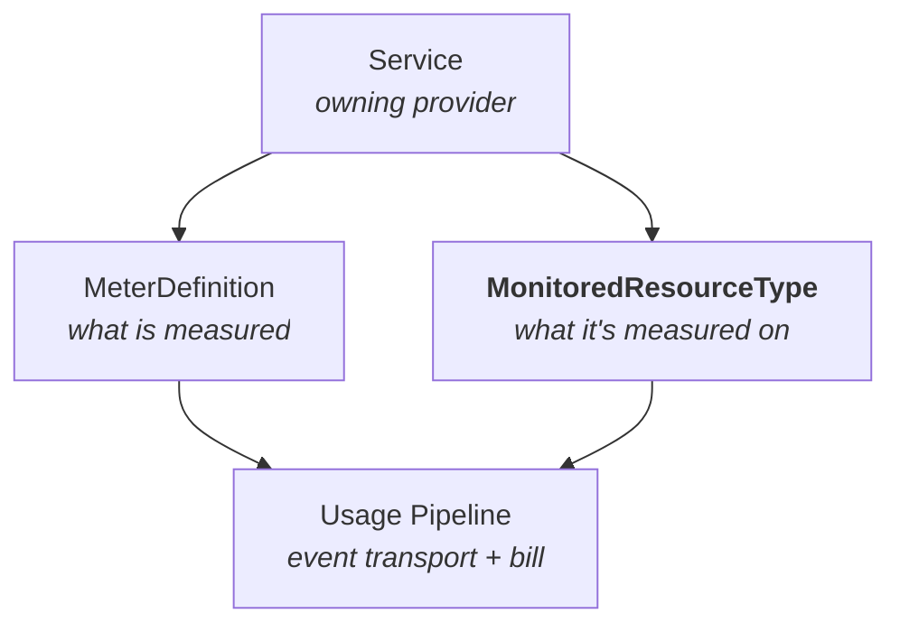

# Enhancement: Monitored Resource Types

**Status:** Draft for stakeholder review
**Author:** Service infrastructure team
**Scope:** Introduces `MonitoredResourceType`, a first-class resource on `services.miloapis.com/v1alpha1`. Sibling to [`Service`](./service-registry.md) and [`MeterDefinition`](./metering-definitions.md); referenced by the [billing usage pipeline](../../../billing/docs/enhancements/usage-pipeline.md).

> **In one line.** The platform's declaration of which Kubernetes Kinds can appear on a bill or a dashboard, and what descriptive labels they're allowed to carry.

---

## What a monitored resource type is

When a bill reads "$412 on compute.miloapis.com/Instance," the consumer can click through to see *which* instances ran in *which* regions on *which* tier. That drill-down isn't free. Milo has to know, ahead of time, which Kubernetes Kinds a provider has registered as "things that can appear on a bill" — and for each such Kind, which descriptive labels (region, tier, zone, machine type) are allowed to ride along with usage events.

A **monitored resource type** is that declaration. One per Kind: *"this is billable, here is who owns it, here are the labels its events may carry."* `MeterDefinition` declares what is being *measured* (CPU seconds, GB-hours). `MonitoredResourceType` declares what is being measured *against*. Together they cover both halves of every usage event.

## Why the platform needs this

Without a platform-owned catalog, every provider answers the question on their own. One provider's instances carry a `region` label; another provider's volumes carry a `zone` label; a third provider shows up with both and uses `area` and `az`. The portal can't render drill-down consistently because it doesn't know which labels are meaningful for which Kinds. Finance can't filter by resource type in reconciliation reports because there's no shared list.

There's also a specific failure mode that deserves its own callout.

### The cardinality trap

If usage events can carry any label, one mistake destroys the system. A service accidentally emits `resource.labels.requestID = "abc-123"` on every event — one unique label per request. Within a day the audit log has millions of unique label combinations instead of the few hundred the business actually uses. Queries slow to a crawl. Storage balloons. And because billing audit is the *record of record*, the data can't just be dropped.

Every observability system that allowed unbounded labels has hit this cliff, including GCP Monitoring in its early years. Billing cannot afford a reshoot. So the platform declares, in writing and up front, the closed set of labels each Kind may carry. Events that try to introduce anything else are rejected before they reach the audit log. Cardinality can't drift because there's nowhere for it to drift *to*.

## How it works

### Declaring a type

A provider publishes one `MonitoredResourceType` per Kubernetes Kind they want to make billable or monitored.

```yaml
apiVersion: services.miloapis.com/v1alpha1
kind: MonitoredResourceType
metadata:
  name: compute-instance
spec:
  phase: Published
  resourceTypeName: compute.miloapis.com/Instance
  displayName: Compute Instance
  description: A virtual machine managed by the compute service.
  owner:
    service: compute.miloapis.com

  gvk:
    group: compute.miloapis.com
    kind: Instance

  labels:
    - name: region
      required: true
      description: Region the instance ran in.
    - name: zone
      required: false
    - name: tier
      required: false
      allowedValues: [standard, premium]
    - name: machineType
      required: false

status:
  publishedAt: "2026-04-15T00:00:00Z"
  conditions:
    - type: Published
      status: "True"
      reason: PhaseIsPublished
```

**Two names, deliberately.** `metadata.name` is the Kubernetes slug. `spec.resourceTypeName` is the canonical business identifier that appears in portal drill-downs and FinOps exports. Same convention as `Service` and `MeterDefinition`.

**Bound to a Kind, not a version.** `spec.gvk` pins the resource type to a Kubernetes Kind — deliberately omitting `version`, because billability is on the Kind, not on a specific API version. A Kind that evolves from `v1alpha1` to `v1` stays billable throughout.

**Labels are a closed set.** `spec.labels` declares every descriptive label events against this Kind may carry. Each label can be required or optional, and can be constrained to a fixed `allowedValues` list when the vocabulary is bounded (tiers, regions, machine types). Anything outside the declared schema is rejected at the edge — this is the cardinality firewall in one field.

**No price, no unit, no per-instance data.** Prices live on pricing rules. Units live on `MeterDefinition`. Individual instances are identified by Kubernetes itself (`group`, `kind`, `namespace`, `name`, `uid`) and carried in the event, not re-declared here.

### Validating an event

A usage event names the instance that produced it. The pipeline looks the Kind up in the catalog and checks that the event's labels match the declared schema.

```yaml
resource:
  ref:
    projectRef: { name: p-abc }
    group: compute.miloapis.com
    kind: Instance
    namespace: default
    name: instance-123
  labels:
    region: us-east-1
    tier: standard
    # requestID: abc-xyz    ← would be rejected: not declared
```

Events that name a Kind with no Published type are rejected. Events with undeclared labels are rejected. Labels with an `allowedValues` list can only carry one of the listed values. Nothing bad reaches the audit log; cardinality stays bounded by the schema.

### Lifecycle

- **Draft.** Iterating. Events against a Draft type are quarantined — nothing bills until the type is real.
- **Published.** Visible everywhere. `resourceTypeName`, `gvk`, and the set of required labels are locked. Display name, description, and new optional labels still evolve additively.
- **Deprecated.** Still billable for existing consumers; hidden from new onboarding. New events attach a visible warning so dashboards can surface who's still emitting.
- **Retired.** No new events. Existing records preserved for audit.

The platform won't let a type be deleted while any unflushed event still references it.

### The bigger picture



`MeterDefinition` answers *what was measured*. `MonitoredResourceType` answers *what kind of thing it was measured on*. Both are governance catalogs; neither owns event data. The pipeline validates against both and carries both identifiers through to the downstream billing provider.

## What this unlocks

- **Safe bill drill-down.** The portal can render "Instances in us-east-1 on the standard tier" because the label vocabulary is declared, not inferred.
- **Resource-type filters in reconciliation reports.** Finance can group usage by Kind without a per-provider join.
- **A protected audit log.** Billing audit stays queryable because cardinality can't drift silently.
- **Consistent labels across signals.** The same catalog that governs billing events is available to quota, telemetry, and audit when they need it.

## What this isn't

- Not an identity system. Kubernetes already identifies individual resources; this catalog governs *types*, not instances.
- Not a metric definition. Units and aggregation live on `MeterDefinition`.
- Not a label discovery mechanism. Providers declare the labels they emit; the pipeline never infers them. That is the point.
- Not a policy engine. Whether a consumer can be billed for a resource type is pricing's and entitlement's job.

## Open questions

1. **Cluster-scoped or namespace-scoped?** Decide together with `Service` and `MeterDefinition` so all three catalogs agree.
2. **Publishing authority.** Self-service by providers, or gated review by billing ops?
3. **Label schema evolution.** Adding optional labels is additive; adding required ones is breaking. Is demoting required → optional post-Publish allowed?
4. **Overlap with quota.** Quota tracks counts; billing tracks usage. Some Kinds matter to both. Shared catalog, or controlled duplication?

---

## References

- [`metering-definitions.md`](./metering-definitions.md) — sibling catalog for measurements
- [`service-registry.md`](./service-registry.md) — identity of the owning service
- [`billing/docs/enhancements/usage-pipeline.md`](../../../billing/docs/enhancements/usage-pipeline.md) — primary consumer today
- GCP Monitored Resources — <https://cloud.google.com/monitoring/api/resources>
