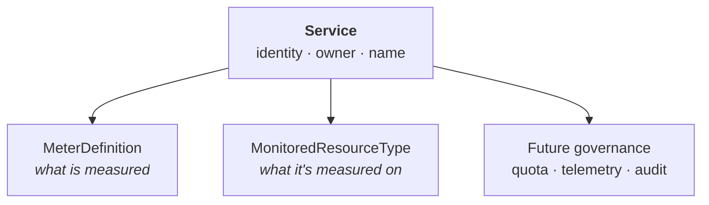

# Enhancement: Service Registry

**Status:** Draft for stakeholder review
**Author:** Service infrastructure team
**Scope:** Introduces `Service`, a first-class resource on `services.miloapis.com/v1alpha1`. Sibling to [`MeterDefinition`](./metering-definitions.md) and [`MonitoredResourceType`](./monitored-resource-types.md).

> **In one line.** A first-class identity record for every managed service a provider offers on Milo.

---

## What a service is

Milo is a multi-tenant platform where *service providers* offer managed services to *consumers*. Compute, storage, networking — any managed capability a provider publishes — is a **service** on Milo.

A service has one provider behind it. It has a public name, a description, a set of resources consumers can create, and a lifecycle that moves from early access through GA to deprecation. Billing, the portal, telemetry, and support all key off service identity — so the platform needs a first-class record of what each one is.

## Why Milo needs a registry

Today, services exist only implicitly. Their resources live under API groups like `compute.miloapis.com`. Their usage carries an owner string. Their documentation lives in separate repos. Nothing on Milo itself says "this is a service, this is who provides it, this is its current state."

That gap costs the platform in small ways that add up.

- A meter references `compute.miloapis.com`; someone types `compute.datumapis.com` on a sibling resource; both get accepted and nobody notices until an invoice is wrong.
- A service is deprecated, but its meters aren't, and charges keep appearing.
- A new provider shows up to publish a service and there's no door to walk through.

A registry makes identity a real object. `Service` is a record the platform actually owns — with a canonical name, a typed owner, a description, and a lifecycle. Every system that used to read a free-text string now resolves a reference instead. Typos fail at create time, not on the invoice.

## How it works

### Registering a service

A provider creates one `Service` per managed service they publish. Everything consumer-facing goes here: the canonical name, the display name, the description. Runtime concerns (deployments, images, routing) stay in the provider's own repo.

```yaml
apiVersion: services.miloapis.com/v1alpha1
kind: Service
metadata:
  name: compute-miloapis-com
spec:
  phase: Published
  serviceName: compute.miloapis.com
  displayName: Compute
  description: Scalable compute workloads and instance management.
  owner:
    producerProjectRef:
      name: compute-platform
status:
  publishedAt: "2026-04-15T00:00:00Z"
  conditions:
    - type: Published
      status: "True"
      reason: PhaseIsPublished
```

**Two names, deliberately.** `metadata.name` is the Kubernetes slug — short, lowercase, used by `kubectl`, access controls, and automation. `spec.serviceName` is the canonical reverse-DNS identifier — the name every other resource references and the name that appears in the portal, on invoices, and in partner listings. Same convention as `MeterDefinition` and `MonitoredResourceType`.

**Typed ownership.** The `owner` points at a real producer-project resource, not a free-text team name. A free string would reintroduce the drift this enhancement is trying to fix.

**Lifecycle in `spec.phase`.** `Draft` → `Published` → `Deprecated` → `Retired`. Provider-declared intent; the controller mirrors it via a `Published` condition and stamps `status.publishedAt` on the first transition into `Published`. Transitions are forward-only — backwards and skip moves are rejected at admission. Details below.

### How other resources reference it

Everything that needs to say "who provides this?" references the service by `spec.serviceName`. Governance resources like `MeterDefinition` and `MonitoredResourceType` already carry an `owner.service` field for this. Once the registry ships, that field becomes a validated reference.

```yaml
apiVersion: services.miloapis.com/v1alpha1
kind: MeterDefinition
spec:
  owner:
    service: compute.miloapis.com
  # …
```

Future consumers — quota buckets, telemetry descriptors, audit lineage, marketplace listings — attach the same way. One `Service`, many downstream resources pointing at it.

### Lifecycle

Services change. They graduate from alpha to GA. They rebrand. They eventually retire when capabilities consolidate. Four states cover every case:

- **Draft.** Iterating on identity and description. Not yet real to downstream systems. Resources pointing at a Draft service are rejected at create.
- **Published.** The steady state. `serviceName` is locked. Display name, description, and owner still editable.
- **Deprecated.** Winding down. Existing references still accepted, but with a visible warning so dashboards can surface who's still depending on it.
- **Retired.** No new references. Existing records preserved for audit.

Breaking changes — renames, ownership transfers — ship as a new `Service` and a coordinated migration, never a silent mutation. The platform also won't let a service be deleted while anything still references it, so identity never vanishes from under pricing, invoicing, or monitoring.

### The bigger picture

Every governance resource that names its owner references `Service.spec.serviceName`. The registry is the identity spine; nothing else re-declares display names, descriptions, or ownership.



## What this unlocks

- **Validated identity.** Typos and drift fail at create, not on an invoice.
- **One description, one lifecycle, everywhere.** Portal, marketplace, and internal tools all read the same record.
- **A door for onboarding.** A provider registers a service once; everything downstream reads from the registration.
- **A foundation for the larger catalog.** Entitlements, configuration versioning, and marketplace layer on top of this identity.

## What this isn't

- Not an access-control system. Who can *call* a service is IAM's job; who can *bill* for one is billing's.
- Not runtime service discovery. No endpoints, no health checks, no load balancing.
- Not routing or DNS. The reverse-DNS `serviceName` is an identifier, not an address.
- Not a deployment manifest. How a service runs stays with the service.

## What comes later

The broader service-catalog vision ([`service-catalog/DESIGN.md`](../../../service-catalog/DESIGN.md)) proposes more than identity. This enhancement is the v0 identity slice; the rest lands when a concrete consumer demands it.

- **`ServiceProvider`** — the onboarding record for organizations becoming providers on Milo. Lands when we bring on providers beyond the platform's own teams.
- **`ServiceEntitlement`** — the record that a consumer's project has enabled a specific service. The consumer-side mirror of `ServiceProvider`. Lands when the portal or IAM blocks on it.
- **Launch stages, icons, categories, marketplace metadata** — added when the portal and marketplace can render them.

## Open questions

1. **Shape of `spec.owner`.** `producerProjectRef` (typed, our default) vs. a `team` string vs. a future `Team` CRD. Confirm before code generation.
2. **Cluster-scoped or namespace-scoped?** Same question for all three governance catalogs. Leaning cluster-scoped; decide together.
3. **Who can create a `Service`?** Self-service by the provider, or gated by a platform-team review? Same shape as the publishing-authority question on `MeterDefinition`.
4. **Project cascade.** If the owning producer project is deleted, does the service go with it? The delete-protection should block it, but the interaction deserves an explicit call-out.

---

## References

- [`monitored-resource-types.md`](./monitored-resource-types.md) — sibling governance catalog
- [`metering-definitions.md`](./metering-definitions.md) — sibling governance catalog
- [`service-catalog/DESIGN.md`](../../../service-catalog/DESIGN.md) — broader vision; v1+ resources deferred
